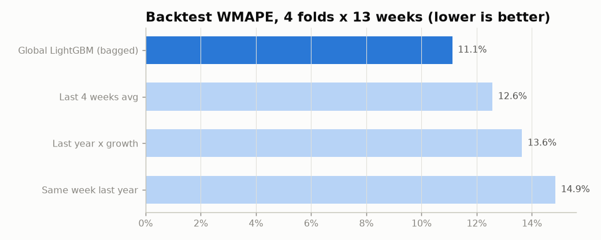
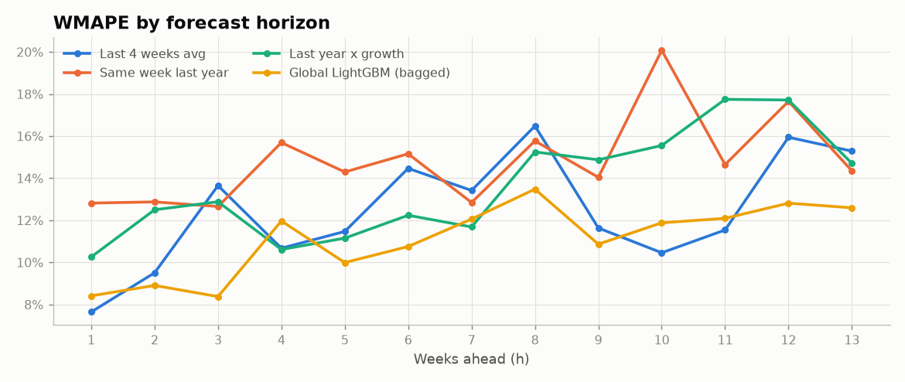
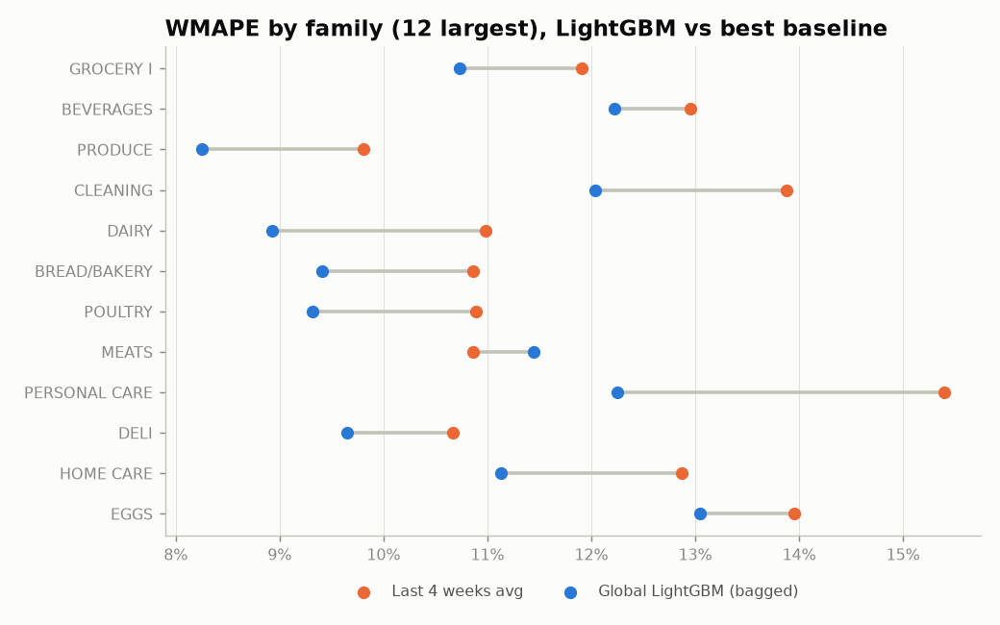
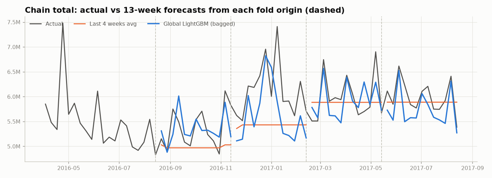

# Model comparison - rolling-origin backtest

_Auto-generated by `python main.py --step models`._

**Setup.** 4 folds, each forecasting 13 weeks from its origin using only data up to the
origin (target weeks of training rows <= origin, asserted in code). Metrics on all valid series-weeks.

## Headline

Global LightGBM reaches **WMAPE 11.1%** vs 12.6% for the best
baseline (Last 4 weeks avg), a **12% relative error reduction**. Bias -3.6%
(negative = under-forecast).

LightGBM is better than "Last 4 weeks avg" for **68% of series** (covering 78% of units),
**85% of stores** and **79% of families**.

|               |   WMAPE |   Bias |     RMSE |     MAE |
|:--------------|--------:|-------:|---------:|--------:|
| naive_ma4     |   0.126 | -0.055 | 1819.837 | 440.120 |
| snaive        |   0.149 | -0.080 | 2127.644 | 519.946 |
| snaive_growth |   0.136 | -0.035 | 1971.219 | 477.631 |
| lgbm          |   0.111 | -0.036 | 1659.457 | 389.134 |

## By fold (each fold = a different 13-week season)

|   fold |   WMAPE naive_ma4 |   WMAPE snaive |   WMAPE snaive_growth |   WMAPE lgbm |   Bias naive_ma4 |   Bias snaive |   Bias snaive_growth |   Bias lgbm |   actual units |
|-------:|------------------:|---------------:|----------------------:|-------------:|-----------------:|--------------:|---------------------:|------------:|---------------:|
|      1 |             0.118 |          0.162 |                 0.138 |        0.106 |           -0.018 |        -0.125 |               -0.067 |      -0.044 |   77940480.000 |
|      2 |             0.110 |          0.159 |                 0.150 |        0.099 |           -0.016 |        -0.063 |                0.036 |      -0.012 |   77773400.000 |
|      3 |             0.155 |          0.153 |                 0.144 |        0.136 |           -0.116 |        -0.109 |               -0.092 |      -0.082 |   79767832.000 |
|      4 |             0.120 |          0.117 |                 0.111 |        0.102 |           -0.071 |        -0.019 |               -0.014 |      -0.002 |   69771024.000 |

## By horizon

|   h |   WMAPE naive_ma4 |   WMAPE snaive |   WMAPE snaive_growth |   WMAPE lgbm |   Bias naive_ma4 |   Bias snaive |   Bias snaive_growth |   Bias lgbm |   actual units |
|----:|------------------:|---------------:|----------------------:|-------------:|-----------------:|--------------:|---------------------:|------------:|---------------:|
|   1 |             0.076 |          0.128 |                 0.103 |        0.084 |           -0.010 |        -0.088 |               -0.041 |      -0.021 |   22394510.000 |
|   2 |             0.095 |          0.129 |                 0.125 |        0.089 |            0.018 |        -0.075 |                0.038 |      -0.030 |   21773826.000 |
|   3 |             0.136 |          0.127 |                 0.129 |        0.084 |           -0.124 |        -0.046 |               -0.101 |      -0.038 |   25323688.000 |
|   4 |             0.107 |          0.157 |                 0.106 |        0.120 |           -0.069 |        -0.119 |               -0.019 |      -0.054 |   23816228.000 |
|   5 |             0.115 |          0.143 |                 0.111 |        0.100 |           -0.049 |        -0.062 |               -0.042 |      -0.044 |   23322948.000 |
|   6 |             0.145 |          0.152 |                 0.122 |        0.108 |           -0.063 |        -0.100 |               -0.025 |      -0.025 |   23675484.000 |
|   7 |             0.134 |          0.128 |                 0.117 |        0.121 |           -0.079 |        -0.042 |               -0.036 |       0.021 |   24081236.000 |
|   8 |             0.165 |          0.158 |                 0.152 |        0.135 |           -0.126 |        -0.125 |               -0.093 |      -0.095 |   25380408.000 |
|   9 |             0.116 |          0.140 |                 0.149 |        0.109 |           -0.015 |        -0.083 |                0.016 |      -0.025 |   22522566.000 |
|  10 |             0.105 |          0.201 |                 0.156 |        0.119 |           -0.013 |        -0.001 |               -0.009 |      -0.007 |   22464508.000 |
|  11 |             0.115 |          0.146 |                 0.177 |        0.121 |            0.000 |        -0.082 |                0.035 |      -0.026 |   22170128.000 |
|  12 |             0.159 |          0.177 |                 0.177 |        0.128 |           -0.136 |        -0.122 |               -0.136 |      -0.063 |   25735326.000 |
|  13 |             0.153 |          0.143 |                 0.147 |        0.126 |           -0.016 |        -0.095 |               -0.011 |      -0.054 |   22591886.000 |

## By store type

| store_type   |   WMAPE naive_ma4 |   WMAPE snaive |   WMAPE snaive_growth |   WMAPE lgbm |   Bias naive_ma4 |   Bias snaive |   Bias snaive_growth |   Bias lgbm |   actual units |
|:-------------|------------------:|---------------:|----------------------:|-------------:|-----------------:|--------------:|---------------------:|------------:|---------------:|
| A            |             0.130 |          0.150 |                 0.131 |        0.114 |           -0.069 |        -0.105 |               -0.058 |      -0.057 |  100170552.000 |
| B            |             0.148 |          0.161 |                 0.158 |        0.124 |           -0.065 |        -0.083 |               -0.033 |      -0.038 |   42273460.000 |
| C            |             0.129 |          0.149 |                 0.143 |        0.113 |           -0.049 |        -0.061 |               -0.032 |      -0.029 |   45163320.000 |
| D            |             0.110 |          0.135 |                 0.125 |        0.099 |           -0.041 |        -0.060 |               -0.016 |      -0.022 |   98653792.000 |
| E            |             0.126 |          0.182 |                 0.158 |        0.122 |           -0.053 |        -0.097 |               -0.026 |      -0.019 |   18991624.000 |

## By family (sorted by volume)

| family                     |   WMAPE naive_ma4 |   WMAPE snaive |   WMAPE snaive_growth |   WMAPE lgbm |   Bias naive_ma4 |   Bias snaive |   Bias snaive_growth |   Bias lgbm |   actual units |
|:---------------------------|------------------:|---------------:|----------------------:|-------------:|-----------------:|--------------:|---------------------:|------------:|---------------:|
| GROCERY I                  |             0.119 |          0.145 |                 0.137 |        0.107 |           -0.065 |        -0.083 |               -0.017 |      -0.024 |   90490200.000 |
| BEVERAGES                  |             0.130 |          0.175 |                 0.152 |        0.122 |           -0.060 |        -0.112 |               -0.069 |      -0.058 |   67862944.000 |
| PRODUCE                    |             0.098 |          0.093 |                 0.088 |        0.083 |           -0.045 |        -0.046 |               -0.035 |      -0.033 |   45713684.000 |
| CLEANING                   |             0.139 |          0.147 |                 0.142 |        0.120 |           -0.049 |        -0.077 |               -0.054 |      -0.051 |   24113276.000 |
| DAIRY                      |             0.110 |          0.129 |                 0.103 |        0.089 |           -0.034 |        -0.110 |               -0.001 |      -0.015 |   17967868.000 |
| BREAD/BAKERY               |             0.109 |          0.140 |                 0.123 |        0.094 |           -0.022 |        -0.077 |               -0.002 |      -0.031 |   10677720.000 |
| POULTRY                    |             0.109 |          0.126 |                 0.117 |        0.093 |           -0.020 |        -0.012 |               -0.029 |      -0.027 |    7647516.000 |
| MEATS                      |             0.109 |          0.135 |                 0.132 |        0.114 |           -0.037 |        -0.066 |               -0.040 |      -0.029 |    7230232.000 |
| PERSONAL CARE              |             0.154 |          0.163 |                 0.171 |        0.122 |           -0.051 |        -0.033 |               -0.018 |      -0.029 |    6280598.000 |
| DELI                       |             0.107 |          0.151 |                 0.134 |        0.097 |           -0.034 |        -0.079 |               -0.058 |      -0.051 |    6094487.000 |
| HOME CARE                  |             0.129 |          0.153 |                 0.152 |        0.111 |           -0.043 |        -0.074 |               -0.043 |      -0.045 |    5900698.000 |
| EGGS                       |             0.139 |          0.178 |                 0.164 |        0.130 |           -0.037 |        -0.118 |               -0.036 |      -0.067 |    3851857.000 |
| FROZEN FOODS               |             0.362 |          0.200 |                 0.224 |        0.195 |           -0.281 |         0.007 |               -0.013 |      -0.040 |    3532002.500 |
| PREPARED FOODS             |             0.132 |          0.192 |                 0.155 |        0.131 |           -0.005 |         0.036 |                0.028 |       0.024 |    2002865.250 |
| LIQUOR,WINE,BEER           |             0.292 |          0.304 |                 0.300 |        0.247 |           -0.068 |        -0.063 |               -0.005 |      -0.021 |    1911218.000 |
| HOME AND KITCHEN I         |             0.330 |          0.397 |                 0.402 |        0.308 |           -0.089 |        -0.106 |                0.014 |       0.064 |     650780.000 |
| HOME AND KITCHEN II        |             0.263 |          0.543 |                 0.474 |        0.334 |           -0.106 |         0.028 |               -0.026 |       0.071 |     555122.000 |
| GROCERY II                 |             0.277 |          0.315 |                 0.278 |        0.240 |           -0.198 |        -0.129 |               -0.177 |      -0.153 |     480590.000 |
| SEAFOOD                    |             0.171 |          0.205 |                 0.173 |        0.153 |            0.019 |         0.052 |                0.028 |       0.011 |     438038.688 |
| CELEBRATION                |             0.237 |          0.289 |                 0.266 |        0.261 |           -0.037 |         0.038 |                0.005 |       0.028 |     273619.000 |
| LAWN AND GARDEN            |             0.406 |          0.649 |                 0.408 |        0.379 |           -0.125 |        -0.630 |               -0.312 |      -0.138 |     260041.000 |
| LADIESWEAR                 |             0.198 |          0.238 |                 0.232 |        0.194 |           -0.031 |        -0.035 |               -0.026 |      -0.039 |     230175.000 |
| PLAYERS AND ELECTRONICS    |             0.226 |          0.326 |                 0.309 |        0.238 |           -0.080 |        -0.158 |               -0.062 |      -0.059 |     225299.000 |
| PET SUPPLIES               |             0.188 |          0.311 |                 0.226 |        0.181 |           -0.078 |        -0.275 |               -0.058 |      -0.055 |     159970.000 |
| SCHOOL AND OFFICE SUPPLIES |             1.199 |          0.804 |                 0.855 |        0.864 |           -0.391 |        -0.494 |               -0.474 |      -0.311 |     151257.000 |
| AUTOMOTIVE                 |             0.232 |          0.308 |                 0.282 |        0.215 |           -0.032 |        -0.004 |               -0.007 |       0.000 |     138864.000 |
| LINGERIE                   |             0.351 |          0.466 |                 0.426 |        0.305 |           -0.051 |        -0.113 |               -0.146 |      -0.126 |     130938.000 |
| MAGAZINES                  |             0.227 |          0.329 |                 0.485 |        0.235 |           -0.028 |        -0.133 |                0.251 |       0.062 |     127128.000 |
| BEAUTY                     |             0.315 |          0.357 |                 0.376 |        0.299 |            0.004 |        -0.178 |                0.051 |       0.075 |     108371.000 |
| HARDWARE                   |             0.420 |          0.561 |                 0.496 |        0.396 |           -0.076 |        -0.049 |               -0.072 |      -0.034 |      26061.000 |
| HOME APPLIANCES            |             0.711 |          0.885 |                 0.964 |        0.697 |           -0.105 |        -0.226 |               -0.127 |      -0.248 |       8598.000 |
| BOOKS                      |             1.169 |          1.344 |                 1.344 |        1.368 |            0.434 |         0.622 |                0.622 |       0.657 |       5892.000 |
| BABY CARE                  |             0.796 |          1.087 |                 1.069 |        0.851 |            0.004 |         0.074 |                0.184 |       0.157 |       4837.000 |

Per-store results: `metrics_by_store.csv`. Row-level predictions: `cv_predictions.parquet`.

## Charts

