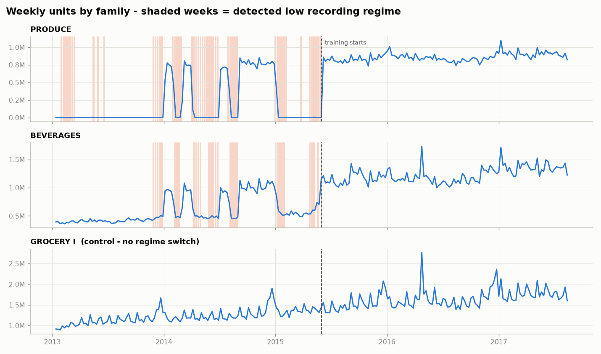
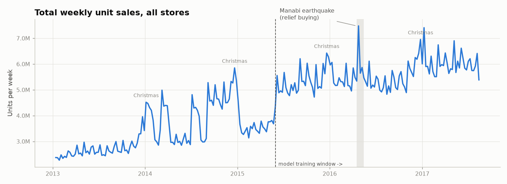
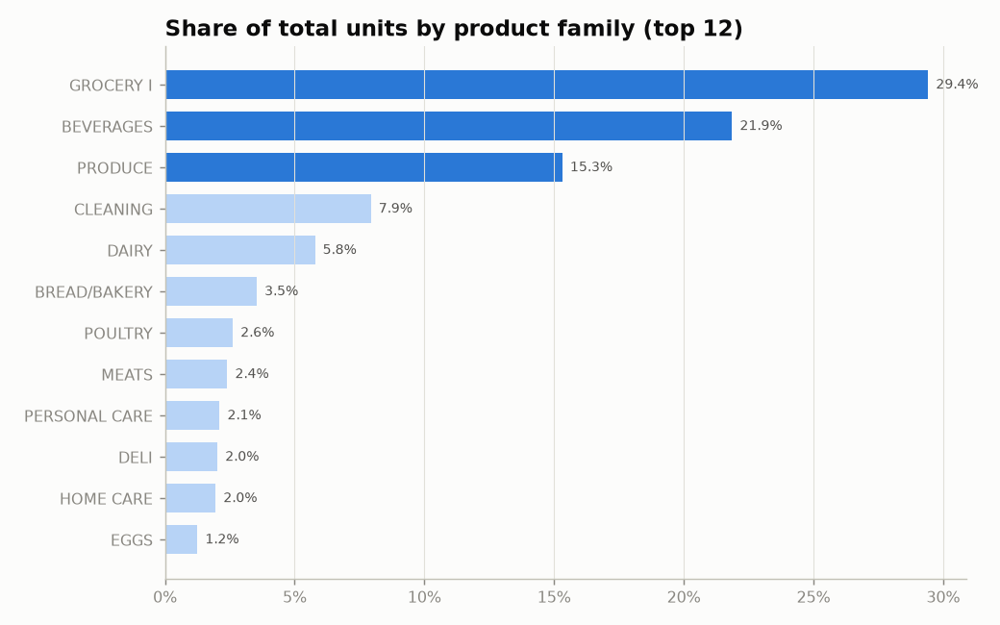
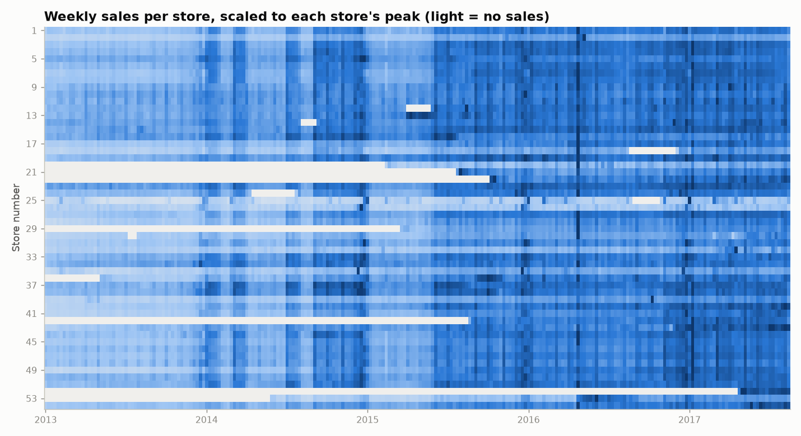
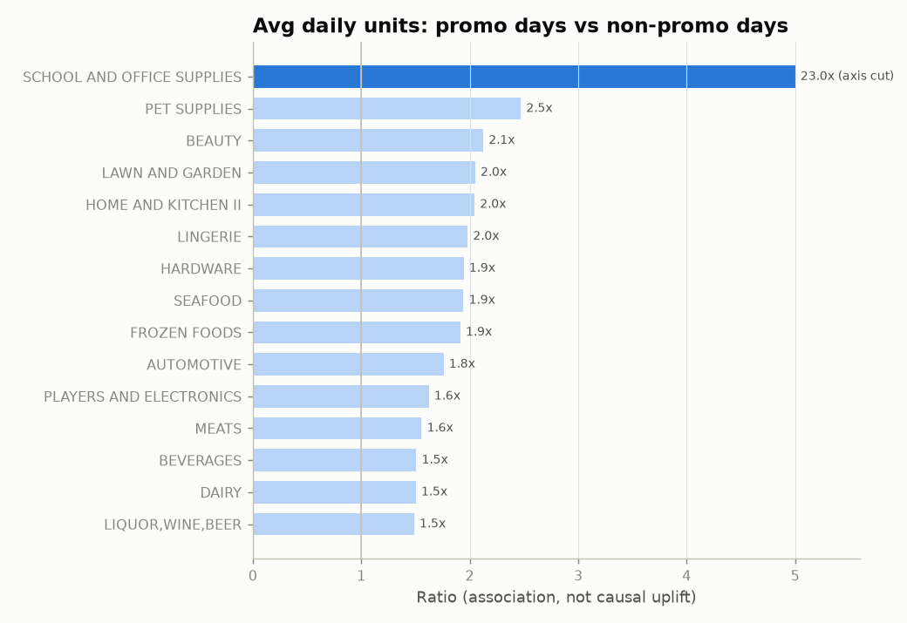
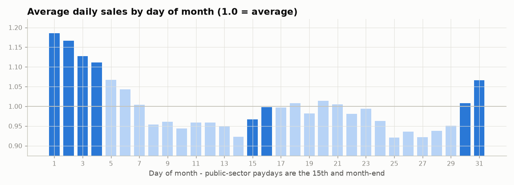
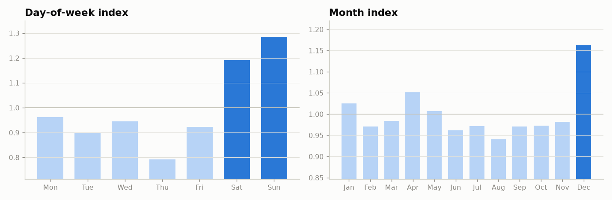
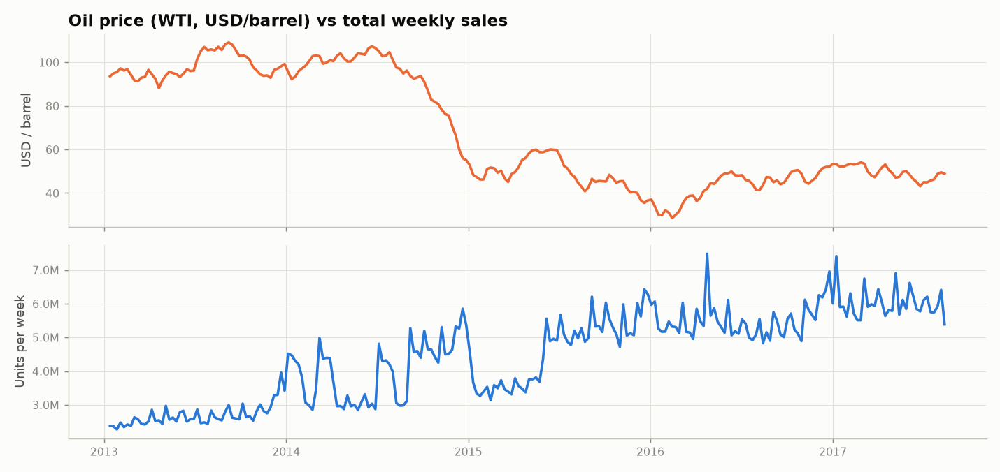
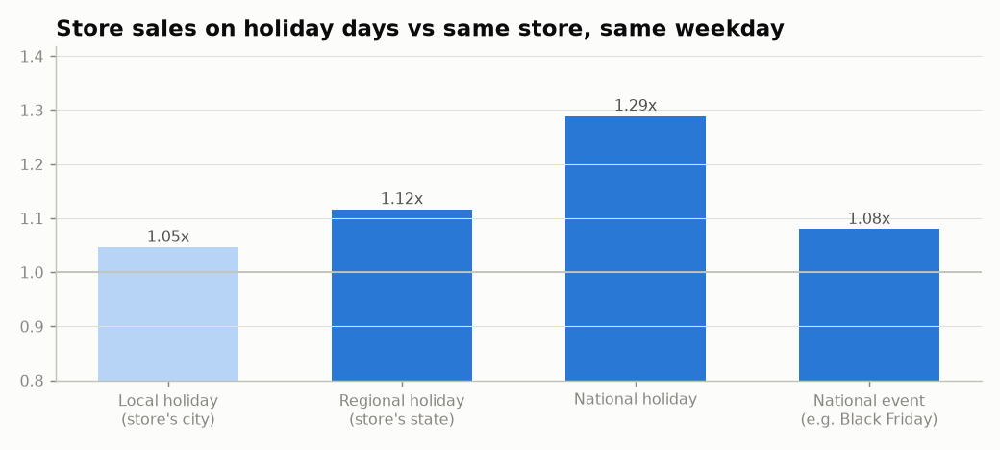
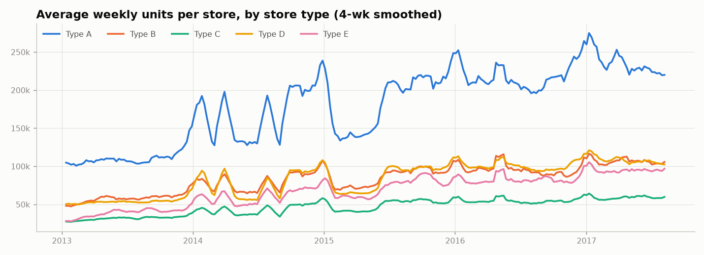

# FreshBasket - Data Quality & EDA Report

_Auto-generated by `python main.py --step eda`. All figures are computed from `data/raw/`._

## 1. Data-quality checks

| Check                                                        | Result                                                                                                                 | Treatment                                            |
|:-------------------------------------------------------------|:-----------------------------------------------------------------------------------------------------------------------|:-----------------------------------------------------|
| Rows in train.csv                                            | 3,000,888                                                                                                              | -                                                    |
| Date range                                                   | 2013-01-01 -> 2017-08-15                                                                                               | -                                                    |
| Stores x families (series)                                   | 54 x 33 = 1,782                                                                                                        | -                                                    |
| Duplicate (date, store, family) rows                         | 0                                                                                                                      | None found                                           |
| Negative sales values                                        | 0                                                                                                                      | None found                                           |
| Calendar days missing from train                             | 2013-12-25, 2014-12-25, 2015-12-25, 2016-12-25                                                                         | Stores closed on Christmas -> filled with 0 + flag   |
| Rows with zero sales                                         | 31.3%                                                                                                                  | Use Tweedie loss / zero-aware metrics                |
| Series that never sold                                       | 53                                                                                                                     | Forecast = 0 (product not stocked)                   |
| Series discontinued (0 sales in last 8 wks)                  | 43                                                                                                                     | Forecast = 0, flagged for business review            |
| Stores opening after the data starts                         | #20 (2015-02), #21 (2015-07), #22 (2015-10), #29 (2015-03), #36 (2013-05), #42 (2015-08), #52 (2017-04), #53 (2014-05) | Rows before opening excluded from training           |
| New stores (<26 wks history)                                 | 3 store(s)                                                                                                             | Cold start: global model + similar-store features    |
| Store-days fully closed after opening                        | 802                                                                                                                    | Flagged, excluded from training target               |
| Promotion field all-zero before                              | 2014-04-01                                                                                                             | Promo features masked before this date               |
| Oil price missing (trading days)                             | 43 of 1,218                                                                                                            | Time interpolation on full calendar                  |
| Oil price - weekends not quoted                              | Yes                                                                                                                    | Reindexed to daily, interpolated                     |
| Open store-days missing in transactions                      | 118                                                                                                                    | Transactions used only as lagged feature             |
| Recording gaps (>=14 zero days in a normally-selling series) | 2.9% of rows                                                                                                           | Excluded from training target (not real zero demand) |
| Rows before a family's first sale in a store                 | 18.5% of rows                                                                                                          | Excluded (product not yet stocked)                   |
| Holidays marked 'transferred'                                | 12                                                                                                                     | Original date dropped, Transfer date used            |
| Stores metadata coverage                                     | 54 / 54 stores                                                                                                         | Complete                                             |

**Series status used by the forecasting rules**

| status       |   series |
|:-------------|---------:|
| active       |     1653 |
| never_sold   |       53 |
| discontinued |       43 |
| new          |       33 |

## 2. Key findings

_Findings 2-6 use only trustworthy rows (`usable == 1`) from 2015-06-01 onward._

1. **Strong growth with a December peak.** Total recorded sales grew +15% (2015 vs 2014) and
   +19% (2016 vs 2015); part of the early growth is the recording change in finding 11. December runs at 1.16x the average month.
2. **Concentrated portfolio.** GROCERY I (29%), BEVERAGES (22%), PRODUCE (15%) make up
   67% of all units. Forecast error on these three dominates WMAPE.
3. **Weekend shopping.** Saturday/Sunday run at 1.19x / 1.29x the average day.
   Weekly aggregation removes this pattern, so weekly holiday counts must be weekday-aware.
4. **Payday effect.** Sales peak around the month-end payday: days 30-4 run at
   1.11x average vs 0.95x on days 10-14.
   The mid-month payday gives a smaller lift (15th-16th 0.98x vs 14th
   0.92x). A "payday days in week" feature captures this.
5. **Promotions are strongly associated with higher sales.** Promo days sell 1.9x more
   (median across families), up to 23.0x for SCHOOL AND OFFICE SUPPLIES. This is association only:
   retailers promote items that already sell well, which the model must control for.
6. **Holidays depend on location.** Relative to the same store on the same weekday:
   local 1.05x, regional 1.12x, national 1.29x, national events
   1.08x. A Quito holiday must only be applied to Quito stores.
7. **Earthquake shock.** In the 4 weeks after 16-Apr-2016, sales ran +11% vs the 8 weeks before.
   These weeks get an `earthquake` flag so the model does not learn them as normal seasonality.
8. **Oil.** Weekly oil price and total sales correlate at -0.77. Most of this is a shared
   trend (oil fell while the chain grew), not proof of cause. The ablation study tests whether
   oil really improves forecasts.
9. **Data gaps that change modelling.** 53 series never sold and
   43 are discontinued (forecast 0); store openings and
   closures are visible in the heatmap; promotions are unrecorded before 2014-04-01.
10. **Unusual movements.** 9,312 series-weeks deviate more than 5 robust SDs from their
    previous 13-week level. Busiest weeks: 2016-12-25 (238), 2015-12-27 (211), 2015-01-04 (211), 2014-12-28 (207), 2015-01-11 (184).
    These are mostly Christmas / New Year weeks (real seasonality the model must learn), plus
    recording breaks. Details in `unusual_movements.csv`.
11. **Recording-regime switches (most important data issue).** PRODUCE (51 weeks, last 2015-05-31), HOME CARE (37 weeks, last 2015-05-03), BEVERAGES (29 weeks, last 2015-05-24)
    alternate between two recording levels. PRODUCE flips between ~30 whole units/day and
    ~10,000 decimal units/day per store - a unit-of-measure change, not demand. No switch occurs
    after 2015-05-31, so **model training starts 2015-06-01**; older data is used for EDA only.
    The same detector also fires for FROZEN FOODS, but those
    dips repeat every year around Christmas after 2015-06-01: real seasonality, kept as demand.

## 3. Charts

## 4. Implications for the model

| Finding | Modelling decision |
|---|---|
| PRODUCE / BEVERAGES regime switches until 2015-05 | Train from 2015-06-01; regime chart documents why |
| 31% zeros, skewed volumes | Tweedie objective in LightGBM; WMAPE as the headline metric |
| Never-sold / discontinued series | Business rule: forecast 0, reported separately |
| Late-opening & new stores | Exclude pre-opening rows; global model shares patterns for cold start |
| Promo not recorded before 2014-04 | Train from 2014-04 onward or mask promo features |
| Location-specific holidays | Holiday counts per week built per store (city/state matched) |
| Paydays, December peak | Payday-day counts, week-of-year and Fourier seasonality features |
| Earthquake | Event flag; excluded weeks from anomaly-sensitive statistics |
| Oil trend | Tested in ablation; lagged values only to avoid leakage |
