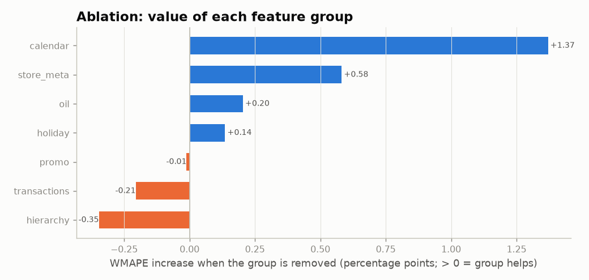

# Ablation / feature-impact study

_Auto-generated by `python main.py --step ablation`. Same model, retrained without one feature group
at a time, on backtest folds 1, 3 (1 = latest 13 weeks, 3 = Christmas period).
1 bag per variant so all variants are compared like for like._

| variant              |   WMAPE fold 1 |   WMAPE fold 3 |   WMAPE avg |   change vs full (pts) |   relative change | verdict       |
|:---------------------|---------------:|---------------:|------------:|-----------------------:|------------------:|:--------------|
| without calendar     |         0.1224 |         0.1535 |      0.1379 |                 1.3708 |            0.1103 | helps         |
| without store_meta   |         0.1075 |         0.1526 |      0.1301 |                 0.5818 |            0.0468 | helps         |
| without oil          |         0.1090 |         0.1435 |      0.1263 |                 0.2041 |            0.0164 | helps         |
| without holiday      |         0.1071 |         0.1441 |      0.1256 |                 0.1360 |            0.0109 | helps         |
| full model           |         0.1076 |         0.1408 |      0.1242 |                 0.0000 |            0.0000 | -             |
| without promo        |         0.1095 |         0.1388 |      0.1241 |                -0.0112 |           -0.0009 | neutral       |
| without transactions |         0.1066 |         0.1378 |      0.1222 |                -0.2058 |           -0.0166 | hurts / noise |
| without hierarchy    |         0.1062 |         0.1354 |      0.1208 |                -0.3465 |           -0.0279 | hurts / noise |

Notes: price, distribution and weather are not in this dataset, so they cannot be tested.
Promotions are tested with the promo plan known in advance, as it would be in practice.
