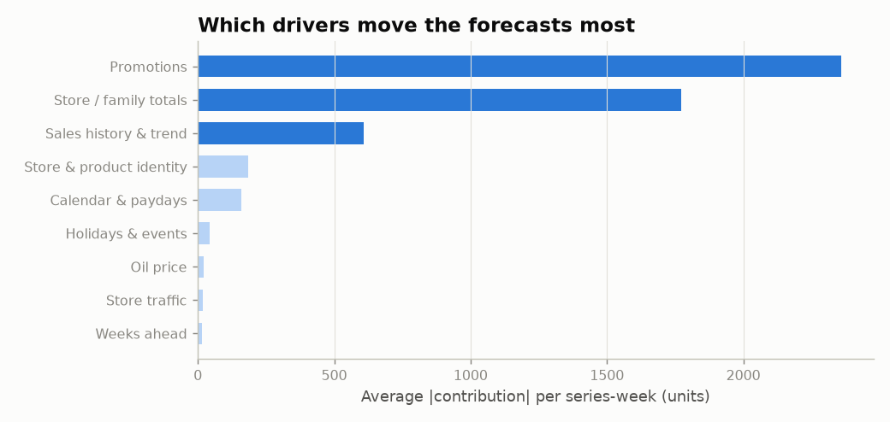
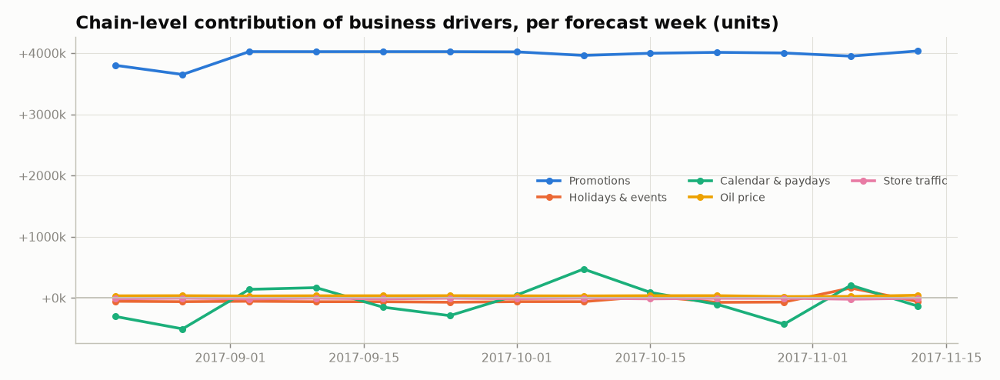
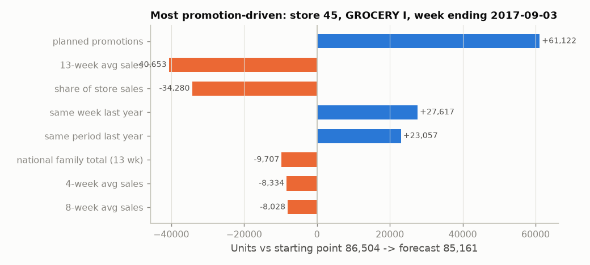
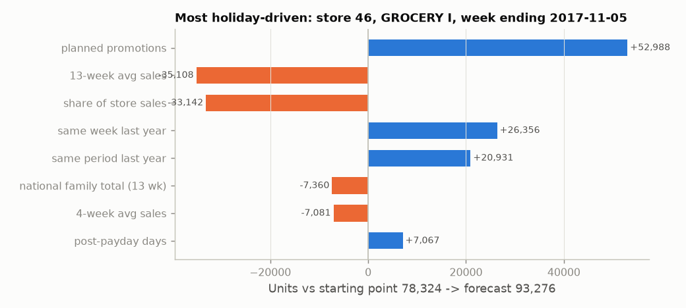

# Driver attribution (TreeSHAP)

_Auto-generated by `python main.py --step explain`. Contributions are in units and add up exactly
to each forecast: forecast = starting point (average model output x recent level) + sum of contributions._

## What drives the next 13 weeks? (chain total)

| Driver group | Net units | Share of forecast | Avg size per series-week (abs) |
|---|---:|---:|---:|
| Promotions | +51,519,042 | +65.6% | 2,358.7 |
| Store / family totals | -38,776,987 | -49.4% | 1,772.5 |
| Sales history & trend | -12,828,385 | -16.3% | 607.3 |
| Store & product identity | -3,181,887 | -4.1% | 183.8 |
| Calendar & paydays | -808,117 | -1.0% | 158.5 |
| Holidays & events | -507,777 | -0.6% | 42.2 |
| Oil price | +427,908 | +0.5% | 20.1 |
| Store traffic | -136,355 | -0.2% | 18.4 |
| Weeks ahead | +65,613 | +0.1% | 14.1 |

Total forecast 78,478,087 units (excluding zero-rule series). "Net" can be small even for an
important group when ups and downs cancel; the last column shows how much each group moves
individual forecasts.

## Selected forecasts explained

**Largest forecast: store 45, GROCERY I, week ending 2017-11-05** - forecast 100,297 units = starting point 86,504 +59,273 (planned promotions) -40,792 (13-week avg sales) -35,458 (share of store sales) +28,876 (same week last year) +22,775 (same period last year) 

**Most promotion-driven: store 45, GROCERY I, week ending 2017-09-03** - forecast 85,161 units = starting point 86,504 +61,122 (planned promotions) -40,653 (13-week avg sales) -34,280 (share of store sales) +27,617 (same week last year) +23,057 (same period last year) 

**Most holiday-driven: store 46, GROCERY I, week ending 2017-11-05** - forecast 93,276 units = starting point 78,324 +52,988 (planned promotions) -35,108 (13-week avg sales) -33,142 (share of store sales) +26,356 (same week last year) +20,931 (same period last year) 

_Contributions describe what the model learned from history (association). They support business
reasoning but are not proof of causal effect._
