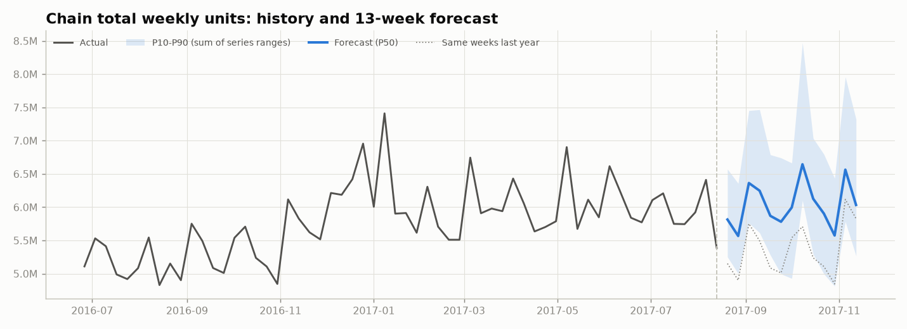
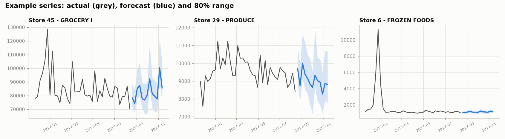

# 13-week forecast

_Auto-generated by `python main.py --step forecast`._

* Forecast weeks: 2017-08-20 -> 2017-11-12 (week ending Sunday), origin = last full
  week of data. 1,782 series x 13 weeks = 23,166 rows in `forecast.csv`.
* Total forecast: **78.5M units**, +12.5% vs the same 13 weeks last year.
* 99 series are forecast at 0 (no sales in the last 8 weeks before the origin).
* Promotions: actual plan from test.csv for 16-31 Aug; later weeks assume each series keeps its
  last-8-week promo level (`promo_assumed_share` = share of days assumed).

## Prediction intervals - are they honest?

P10/P90 come from the model's own backtest errors (split-conformal, by horizon x volume level).
Leave-one-fold-out check - target coverage is 80%:

| held-out fold   |   coverage |   volume-weighted coverage |   avg width / forecast |
|:----------------|-----------:|---------------------------:|-----------------------:|
| 1               |      0.816 |                      0.847 |                  0.300 |
| 2               |      0.792 |                      0.744 |                  0.291 |
| 3               |      0.737 |                      0.652 |                  0.276 |
| 4               |      0.775 |                      0.726 |                  0.287 |
| all             |      0.780 |                      0.742 |                  0.288 |

## Forecast by family (13-week total)

| sku_id                     |   forecast |   forecast_p10 |   forecast_p90 |   same_13w_last_year | vs_last_year   |
|:---------------------------|-----------:|---------------:|---------------:|---------------------:|:---------------|
| GROCERY I                  | 23,177,834 |     20,605,535 |     27,057,964 |           20,464,918 | +13.3%         |
| BEVERAGES                  | 18,065,874 |     16,060,270 |     21,078,591 |           15,167,871 | +19.1%         |
| PRODUCE                    | 11,742,803 |     10,432,160 |     13,699,913 |           10,600,067 | +10.8%         |
| CLEANING                   |  6,206,395 |      5,516,278 |      7,248,699 |            5,535,315 | +12.1%         |
| DAIRY                      |  4,429,934 |      3,924,324 |      5,177,299 |            4,197,347 | +5.5%          |
| BREAD/BAKERY               |  2,739,893 |      2,414,326 |      3,209,730 |            2,572,080 | +6.5%          |
| POULTRY                    |  1,947,899 |      1,696,573 |      2,294,678 |            1,828,871 | +6.5%          |
| MEATS                      |  1,862,544 |      1,624,641 |      2,192,350 |            1,804,439 | +3.2%          |
| DELI                       |  1,547,163 |      1,339,009 |      1,827,767 |            1,411,148 | +9.6%          |
| PERSONAL CARE              |  1,541,703 |      1,331,799 |      1,824,581 |            1,443,031 | +6.8%          |
| HOME CARE                  |  1,483,263 |      1,279,601 |      1,756,607 |            1,412,486 | +5.0%          |
| EGGS                       |    993,393 |        840,345 |      1,184,803 |              936,700 | +6.1%          |
| FROZEN FOODS               |    649,948 |        523,812 |        791,202 |              607,179 | +7.0%          |
| LIQUOR,WINE,BEER           |    463,317 |        359,104 |        572,114 |              416,428 | +11.3%         |
| PREPARED FOODS             |    449,074 |        347,569 |        554,672 |              506,441 | -11.3%         |
| HOME AND KITCHEN I         |    162,163 |        111,052 |        211,196 |              138,457 | +17.1%         |
| GROCERY II                 |    158,344 |        109,147 |        206,707 |               89,670 | +76.6%         |
| HOME AND KITCHEN II        |    156,030 |        106,664 |        203,064 |              118,274 | +31.9%         |
| SCHOOL AND OFFICE SUPPLIES |    120,525 |         94,984 |        149,387 |               41,348 | +191.5%        |
| SEAFOOD                    |    104,577 |         69,050 |        140,130 |              118,993 | -12.1%         |
| LAWN AND GARDEN            |     85,058 |         56,799 |        112,504 |               26,093 | +226.0%        |
| CELEBRATION                |     67,574 |         43,546 |         94,905 |               67,090 | +0.7%          |
| PLAYERS AND ELECTRONICS    |     62,288 |         40,166 |         86,828 |               47,552 | +31.0%         |
| LADIESWEAR                 |     59,223 |         38,653 |         80,555 |               56,739 | +4.4%          |
| PET SUPPLIES               |     46,080 |         28,662 |         65,301 |               34,279 | +34.4%         |
| LINGERIE                   |     37,788 |         22,993 |         55,624 |               29,180 | +29.5%         |
| AUTOMOTIVE                 |     37,782 |         22,965 |         56,432 |               30,294 | +24.7%         |
| MAGAZINES                  |     34,129 |         20,222 |         50,457 |               30,914 | +10.4%         |
| BEAUTY                     |     33,981 |         19,990 |         50,678 |               28,041 | +21.2%         |
| HARDWARE                   |      7,714 |          2,221 |         14,381 |                5,467 | +41.1%         |
| HOME APPLIANCES            |      2,355 |            414 |          4,863 |                1,015 | +132.0%        |
| BABY CARE                  |      1,021 |            117 |          2,180 |                1,404 | -27.3%         |
| BOOKS                      |        423 |             18 |            934 |                1,898 | -77.7%         |

