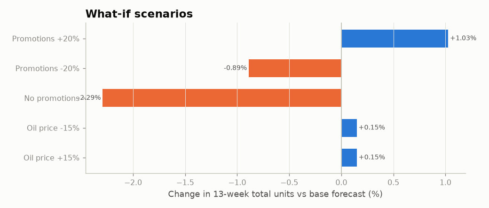
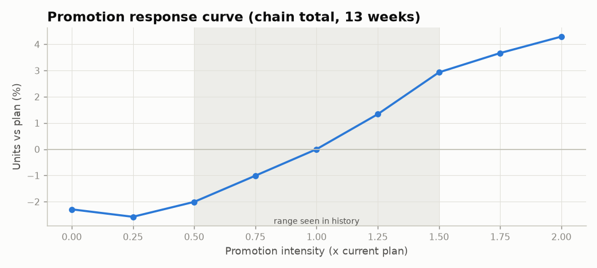
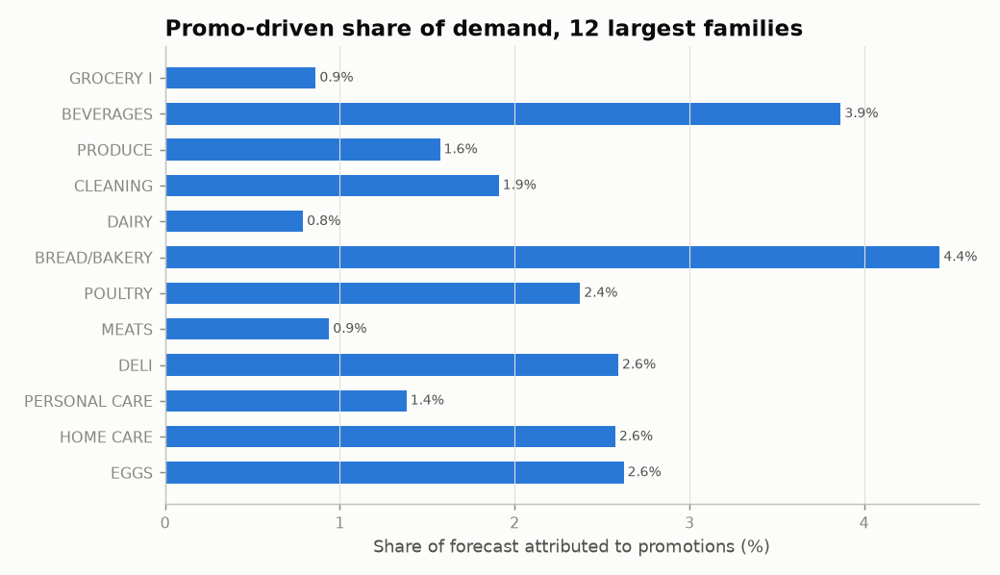

# Scenario / sensitivity analysis

_Auto-generated by `python main.py --step scenario`. Each scenario changes one lever for all 13 future
weeks and re-runs the final model; everything else is held fixed._

## Summary

|                 |   total units (13 wks) |   change vs base (units) | change vs base (%)   |
|:----------------|-----------------------:|-------------------------:|:---------------------|
| Base forecast   |             78,478,087 |                       +0 | +0.00%               |
| Promotions +20% |             79,283,056 |                 +804,969 | +1.03%               |
| Promotions -20% |             77,780,413 |                 -697,673 | -0.89%               |
| No promotions   |             76,679,411 |               -1,798,676 | -2.29%               |
| Oil price -15%  |             78,593,907 |                 +115,820 | +0.15%               |
| Oil price +15%  |             78,594,593 |                 +116,507 | +0.15%               |

## Baseline vs promotion-driven demand

Of the 78,478,087 units forecast, about **1,798,676 units (2.3%)** are
attributed to promotions (base forecast minus the same forecast with no promotions). Families with the
highest share of promo-driven volume: LIQUOR,WINE,BEER (7%), BREAD/BAKERY (4%), BEVERAGES (4%), EGGS (3%), DELI (3%).

|                  |   Base forecast |   No promotions |   promo uplift units | promo uplift % of forecast   | +20% promo effect %   |
|:-----------------|----------------:|----------------:|---------------------:|:-----------------------------|:----------------------|
| GROCERY I        |      23,177,834 |      22,977,878 |              199,956 | +0.9%                        | +0.7%                 |
| BEVERAGES        |      18,065,874 |      17,367,368 |              698,507 | +3.9%                        | +1.0%                 |
| PRODUCE          |      11,742,802 |      11,558,067 |              184,735 | +1.6%                        | +1.4%                 |
| CLEANING         |       6,206,395 |       6,087,870 |              118,525 | +1.9%                        | +1.2%                 |
| DAIRY            |       4,429,933 |       4,394,943 |               34,990 | +0.8%                        | +0.9%                 |
| BREAD/BAKERY     |       2,739,891 |       2,618,443 |              121,448 | +4.4%                        | +1.3%                 |
| POULTRY          |       1,947,898 |       1,901,635 |               46,264 | +2.4%                        | +0.6%                 |
| MEATS            |       1,862,545 |       1,845,050 |               17,495 | +0.9%                        | +0.5%                 |
| DELI             |       1,547,163 |       1,507,039 |               40,125 | +2.6%                        | +1.8%                 |
| PERSONAL CARE    |       1,541,702 |       1,520,400 |               21,302 | +1.4%                        | +0.9%                 |
| HOME CARE        |       1,483,262 |       1,445,042 |               38,219 | +2.6%                        | +1.5%                 |
| EGGS             |         993,394 |         967,325 |               26,070 | +2.6%                        | +1.6%                 |
| FROZEN FOODS     |         649,949 |         638,665 |               11,283 | +1.7%                        | +0.7%                 |
| LIQUOR,WINE,BEER |         463,317 |         431,952 |               31,365 | +6.8%                        | +2.2%                 |
| PREPARED FOODS   |         449,074 |         441,480 |                7,593 | +1.7%                        | +0.3%                 |

## Promotion response curve

|   promo intensity (x current plan) |   total units | vs plan   |
|-----------------------------------:|--------------:|:----------|
|                               0    |    76,679,411 | -2.29%    |
|                               0.25 |    76,455,638 | -2.58%    |
|                               0.5  |    76,901,466 | -2.01%    |
|                               0.75 |    77,685,084 | -1.01%    |
|                               1    |    78,478,087 | +0.00%    |
|                               1.25 |    79,525,780 | +1.34%    |
|                               1.5  |    80,778,130 | +2.93%    |
|                               1.75 |    81,355,626 | +3.67%    |
|                               2    |    81,848,188 | +4.29%    |

**How to read this.** The model reflects historical associations, not a controlled experiment.
Promo effects outside ~x0.5-x1.5 extrapolate beyond what the stores have done before; oil effects
are small because oil enters only as a slow macro signal known at the forecast origin.
